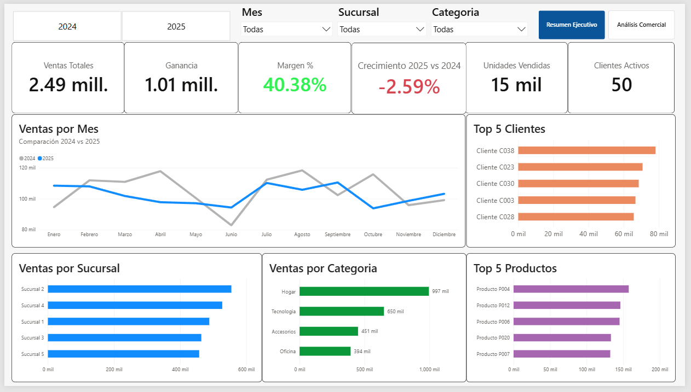
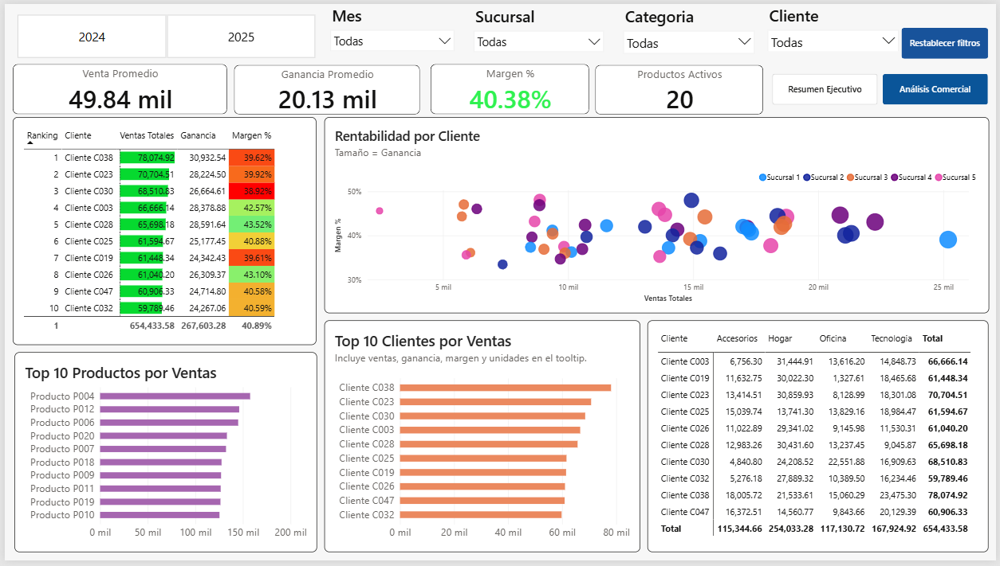
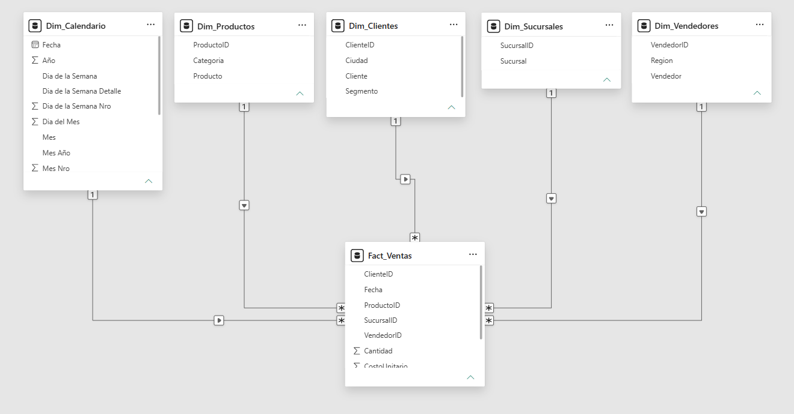

Dashboard Comercial | Power BI

Descripción

Dashboard interactivo desarrollado en **Power BI** para analizar el desempeño comercial de una empresa utilizando un modelo de datos tipo *Star Schema*, medidas en *DAX* y procesos de transformación con *Power Query*.

El proyecto permite analizar ventas, rentabilidad, clientes, productos y sucursales mediante visualizaciones dinámicas e indicadores de negocio.

Tecnologías utilizadas

- Power BI Desktop
- Power Query
- DAX
- Microsoft Excel

Indicadores principales

- Ventas Totales
- Ganancia
- Margen %
- Crecimiento Interanual (2025 vs 2024)
- Clientes Activos
- Unidades Vendidas

Funcionalidades implementadas

- Modelo de datos tipo *Star Schema*
- Comparación interanual (Year over Year)
- KPIs dinámicos
- Tooltips personalizados
- Segmentadores interactivos
- Rankings Top N
- Análisis por Cliente, Producto, Categoría y Sucursal
- Navegación entre páginas mediante botones
- Visualizaciones totalmente interactivas

Dashboard Ejecutivo

---

Análisis Comercial

---

Modelo de Datos

Objetivo del proyecto

Este proyecto fue desarrollado como parte de mi portfolio de **Data Analytics**, aplicando buenas prácticas de modelado de datos, construcción de medidas DAX y diseño de dashboards orientados al análisis de información y apoyo a la toma de decisiones.

Autor

*Sebastián de Medina*

Proyecto desarrollado como parte de mi portfolio profesional de Data Analytics.
